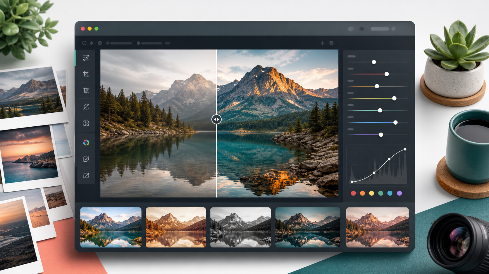

# Photo Style Lab



사진을 열고 색감, 대비, 밝기, 분위기 프리셋을 빠르게 적용해 결과를 비교한 뒤 이미지로 저장하는 무료 오픈소스 웹 앱입니다. SNS 게시용 사진, 제품 소개 이미지, 블로그 썸네일처럼 빠르게 톤을 잡아야 하는 이미지 작업에 맞춰 만들었습니다.

## 무엇을 할 수 있나요?

- 사진을 업로드하거나 드래그 앤 드롭으로 불러오기
- 빈티지, 흑백, 세피아, 고대비, 시네마틱 등 스타일 프리셋 적용
- 원본과 변환 결과를 나란히 비교
- Canvas 기반으로 이미지 색감과 톤 변환
- 마음에 드는 결과를 이미지 파일로 다운로드
- Remix, React, TypeScript 기반이라 수정과 확장이 쉬움

## 이런 경우에 유용합니다

- SNS에 올릴 사진을 조금 더 선명하고 분위기 있게 만들고 싶을 때
- 제품 사진이나 서비스 소개 이미지를 빠르게 정리하고 싶을 때
- 블로그, 뉴스레터, 발표자료에 넣을 이미지를 가볍게 보정하고 싶을 때
- 복잡한 전문 편집툴을 켜지 않고 빠르게 여러 톤을 비교하고 싶을 때
- 이미지 필터, Canvas 처리, Remix UI 예제가 필요한 개발자

## 빠른 시작

```bash
npm install
npm run dev
```

브라우저에서 개발 서버 주소를 열면 바로 사용할 수 있습니다.

## 사용 방법

1. 첫 화면에서 이미지를 선택하거나 드래그 앤 드롭합니다.
2. 스타일 프리셋 목록에서 원하는 분위기를 고릅니다.
3. 원본과 변환 이미지를 비교합니다.
4. 결과가 마음에 들면 다운로드합니다.
5. 다른 이미지를 작업하려면 `새 이미지`를 누릅니다.

## 빌드와 검증

```bash
npm run typecheck
npm run lint
npm run build
npm start
```

## 프로젝트 구조

```text
app/
  components/          UI 컴포넌트
  routes/              Remix 라우트
  utils/               이미지 처리와 필터 로직
public/
  hero.png             README와 첫 화면에 쓰는 대표 이미지
```

## 커스터마이징

- 프리셋 이름과 설명: `app/utils/imageProcessing.ts`
- 실제 이미지 처리 로직: `app/utils/filters.ts`, `app/utils/instaFilters.ts`
- 첫 화면 구성: `app/routes/_index.tsx`
- 업로드 UI: `app/components/ImageUploader.tsx`
- 결과 비교 UI: `app/components/ImagePreview.tsx`

## Q&A

### Q. 완전 무료인가요?

네. MIT 라이선스로 공개했습니다. 개인 프로젝트, 학습, 내부 도구, 상업 프로젝트에서 자유롭게 사용할 수 있습니다.

### Q. 어떤 사진에 가장 잘 맞나요?

SNS 게시용 사진, 제품 사진, 음식 사진, 여행 사진, 블로그 썸네일처럼 색감과 분위기를 빠르게 바꾸고 싶은 이미지에 잘 맞습니다.

### Q. 포토샵 같은 전문 편집툴을 대체하나요?

아닙니다. 정밀 보정이나 레이어 편집보다는 “빠른 스타일 비교와 저장”에 초점을 둔 가벼운 도구입니다.

### Q. 원하는 스타일을 더 추가할 수 있나요?

가능합니다. `app/utils/imageProcessing.ts`에 프리셋을 추가하고, 필터 로직을 `app/utils/filters.ts` 또는 `app/utils/instaFilters.ts`에 구현하면 됩니다.

### Q. 모바일에서도 사용할 수 있나요?

반응형 UI로 구성되어 있어 모바일 브라우저에서도 사용할 수 있습니다. 다만 큰 이미지 파일은 기기 성능에 따라 처리 시간이 달라질 수 있습니다.

### Q. 결과 이미지 품질은 어떻게 정해지나요?

브라우저 Canvas로 변환한 결과를 저장합니다. 원본 크기, 브라우저 처리 방식, 적용한 필터 값에 따라 결과가 달라질 수 있습니다.

### Q. PR이나 기능 제안을 받아주나요?

환영합니다. 더 좋은 프리셋, UI 개선, 성능 개선, 접근성 개선, 테스트 보강 모두 좋은 기여 대상입니다.

## License

MIT
